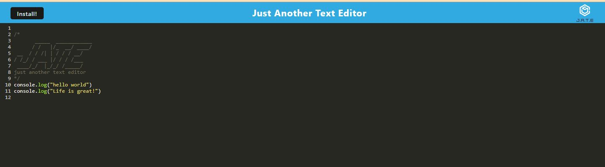
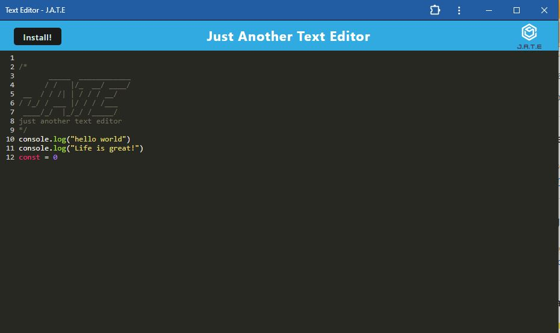

# PWA-Text-Editor

## Description

The PWA-Text-Editor is a single-page web application that meets the PWA(Progressive Web Aplication) criteria. In addiction, features a number of data persistance technique that serve as redundancy in case in case one of the option is not supported by the browser. This application also works offline.

## User story and Acceptance Criteria
`
AS A developer
I WANT to create notes or code snippets with or without an internet connection
SO THAT I can reliably retrieve them for later use
`

`GIVEN a text editor web application
WHEN I open my application in my editor
THEN I should see a client server folder structure
WHEN I run `npm run start` from the root directory
THEN I find that my application should start up the backend and serve the client
WHEN I run the text editor application from my terminal
THEN I find that my JavaScript files have been bundled using webpack
WHEN I run my webpack plugins
THEN I find that I have a generated HTML file, service worker, and a manifest file
WHEN I use next-gen JavaScript in my application
THEN I find that the text editor still functions in the browser without errors
WHEN I open the text editor
THEN I find that IndexedDB has immediately created a database storage
WHEN I enter content and subsequently click off of the DOM window
THEN I find that the content in the text editor has been saved with IndexedDB
WHEN I reopen the text editor after closing it
THEN I find that the content in the text editor has been retrieved from our IndexedDB
WHEN I click on the Install button
THEN I download my web application as an icon on my desktop
WHEN I load my web application
THEN I should have a registered service worker using workbox
WHEN I register a service worker
THEN I should have my static assets pre cached upon loading along with subsequent pages and static assets
WHEN I deploy to Render
THEN I should have proper build scripts for a webpack application`

## Table of Contents 

- [Installation](#installation)
- [Usage](#usage)
- [Technologies](#technologies)
- [Skills Improved](#skills-improved)
- [Author](#author)
- [Credits](#credits)
- [License](#license)

## Installation

1. Clone the repository: https://github.com/clcoder2425/PWA-Text-Editor.git
2. Install dependencies: `npm install`
3. Configure the Enviroment: create a `.env` file and set up the necessary enviroment variables.
4. Build and run the application: `npm run start`

## Usage

### Deployed Application link: https://pwa-texteditor-9xno.onrender.com

## Technologies

### Frontend:

- HTML5
- CSS3
- JavaScript
### Backend:

- Node.js
- Express.js
- IDB 
### Progressive Web App (PWA):

- Service Workers
- Manifest file

## Skills improve
- Configuring webpack
- Deploying to render
- Refactoring code

## Author
Github link: https://github.com/clcoder2425/PWA-Text-Editor.git
## Credits

Tutor team session for guidance.

## License

This PWA Text Editor is open-source and available under the MIT License. Feel free to use, modify, and distribute the code.

## Features

- Offline Support: Use the text editor even when you're not connected to the internet. The PWA caches necessary assets, allowing users to access and edit their documents offline.
- Cross-Platform Compatibility: The app is responsive and works seamlessly on desktops, tablets, and mobile devices, providing a consistent user experience across platforms.
- Auto-Save: The application automatically saves your work, ensuring you never lose important changes. This feature is especially handy during unexpected interruptions.

## How to Contribute

We welcome contributions from the community. If you find any issues or have suggestions for improvements, please create a pull request.
